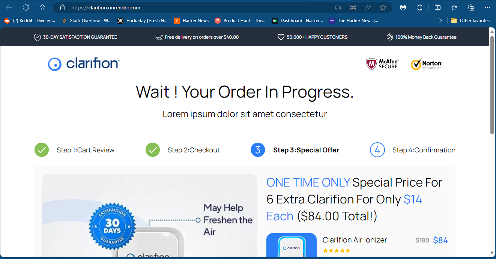
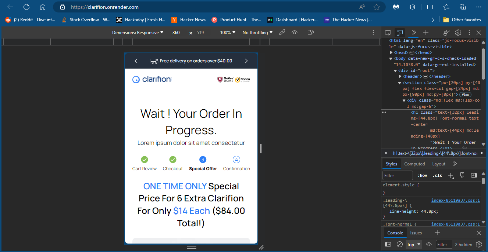

<div align="center">
 <a href="https://imgbox.com/ftUpMLFI" target="_blank"></a>
  <br/>
 </div>
<div align="center">
  <h1><b>Clarifion Upsell</b></h1>
</div>

<!--

REQUIRED SECTIONS:
- Table of Contents
- About the Project
  - Built With
  - Live Demo
- Getting Started
- Authors
- Future Features
- Contributing
- Show your support
- Acknowledgements
- License

OPTIONAL SECTIONS:
- FAQ
-->

# 📗 Table of Contents

- [📗 Table of Contents](#-table-of-contents)
- [🎮 Clarifion-Upsell ](#-clarifion-upsell-)
  - [🛠 Built With ](#-built-with-)
    - [Tech Stack ](#tech-stack-)
    - [Key Features ](#key-features-)
  - [🚀 Live Demo ](#-live-demo-)
  - [💻 Getting Started ](#-getting-started-)
    - [Prerequisites](#prerequisites)
    - [Setup](#setup)
    - [Install](#install)
    - [Usage](#usage)
  - [👥 Author ](#-author-)
  - [🔭 Future Features ](#-future-features-)
  - [🤝 Contributing ](#-contributing-)
  - [⭐️ Show your support ](#️-show-your-support-)
  - [🙏 Acknowledgments ](#-acknowledgments-)
  - [📝 License ](#-license-)

<!-- PROJECT DESCRIPTION -->

# 🎮 Clarifion-Upsell <a name="about-project"></a>

**Clarifion-Upsell** This project corresponds to a take home challenge for eJam recruinment proccess. This is a Front-end
project where I recreated the provided UI/UX design. The project was built using React and and TailwindCSS.

<h2 align="center">Desktop</h2>

<div align="center">
 <a href="./screenshots/desktop.png" target="_blank"></a>
  <br/>
 </div>

 <h2 align="center">Mobile</h2>

 <div align="center">
 <a href="./screenshots/mobile.png" target="_blank"></a>
  <br/>
 </div>

## 🛠 Built With <a name="built-with"></a>
- `React.js`
- `TailwindCSS`

### Tech Stack <a name="tech-stack"></a>

<details>
  <summary>Style framework</summary>
  <ul>
    <li><a href="https://v2.tailwindcss.com/">TailwindCSS</a></li>
  </ul>
</details>

<details>
<summary>Front-end Framework</summary>
  <ul>
    <li><a href="https://react.dev/">React.js</a></li>
  </ul>
</details>

<!-- Features -->

### Key Features <a name="key-features"></a>

- **[Desktop interface (>768px)]**
- **[Mobile (first) interface (360px)]**

<p align="right">(<a href="#readme-top">back to top</a>)</p>

<!-- LIVE DEMO -->

## 🚀 Live Demo <a name="live-demo"></a>

- [Live Demo Link](https://clarifion.onrender.com/)

<p align="right">(<a href="#readme-top">back to top</a>)</p>


<!-- GETTING STARTED -->

## 💻 Getting Started <a name="getting-started"></a>

To get a local copy up and running, follow these steps.

### Prerequisites

In order to run this project you need:
- Visual Studio Code
- Node.js

### Setup

Clone this repository to your desired folder:

```sh
  git clone https://github.com/sanieni6/Clarifion-Upsell.git
  cd Clarifion-Upsell
```

### Install

Install this project with:

 - `npm install`


### Usage

To start the server, execute the following command:

`npm run dev`


<p align="right">(<a href="#readme-top">back to top</a>)</p>

<!-- AUTHORS -->

## 👥 Author <a name="authors"></a>

👤 **Luis Sanchez**

- Github: [GitHub](https://github.com/sanieni6/)
- Twitter: [Twitter](https://twitter.com/its_luis_sz23)
- Linkedin:  [LinkedIn](https://www.linkedin.com/in/luissanchezz3/)

<p align="right">(<a href="#readme-top">back to top</a>)</p>

<!-- FUTURE FEATURES -->

## 🔭 Future Features <a name="future-features"></a>

- [ ] **[Add more responsivity]**
- [ ] **[Add manimations to the buttons]**
- [ ] **[Add transitions]**

<p align="right">(<a href="#readme-top">back to top</a>)</p>

<!-- CONTRIBUTING -->

## 🤝 Contributing <a name="contributing"></a>

Contributions, issues, and feature requests are welcome!

Feel free to check the [issues page](https://github.com/sanieni6/Clarifion-Upsell/issues).

<p align="right">(<a href="#readme-top">back to top</a>)</p>

<!-- SUPPORT -->

## ⭐️ Show your support <a name="support"></a>

If you like this project please give it a star ⭐️

<p align="right">(<a href="#readme-top">back to top</a>)</p>

<!-- ACKNOWLEDGEMENTS -->

## 🙏 Acknowledgments <a name="acknowledgements"></a>

I would like to thank 
  eJAM for giving me the opportunity to work on this project.


<p align="right">(<a href="#readme-top">back to top</a>)</p>

<!-- LICENSE -->

## 📝 License <a name="license"></a>

This project is [MIT](./LICENSE) licensed.

<p align="right">(<a href="#readme-top">back to top</a>)</p>


